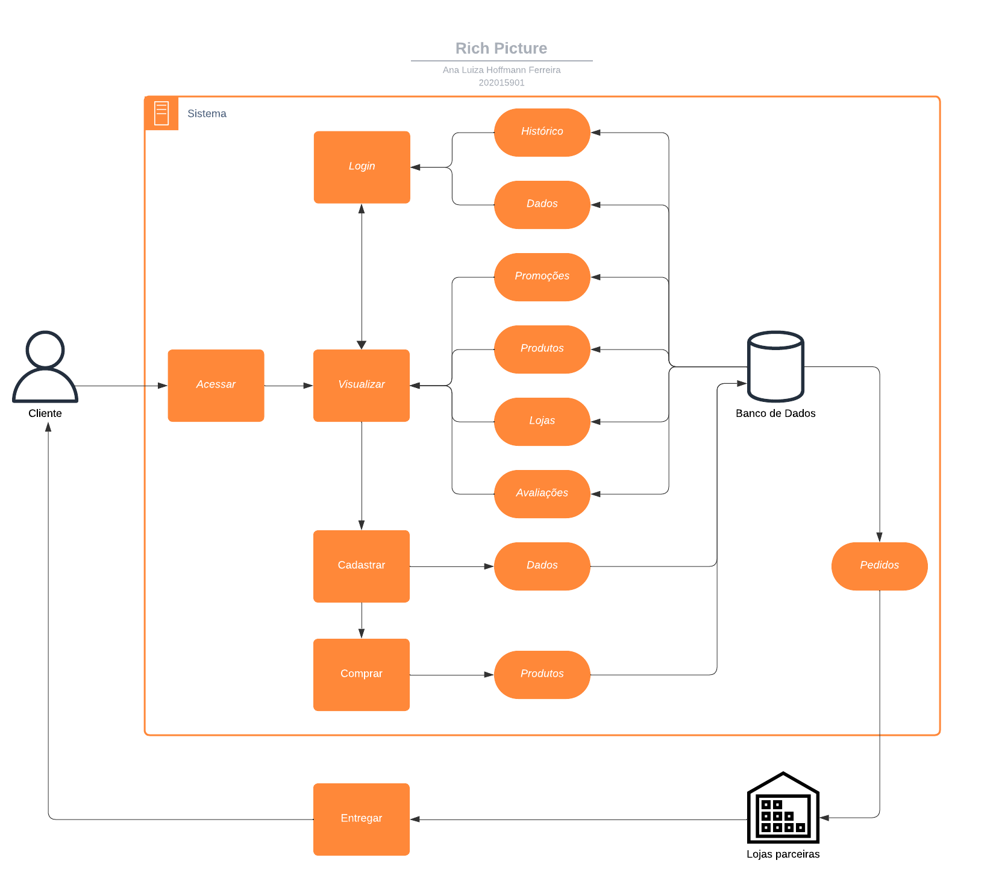
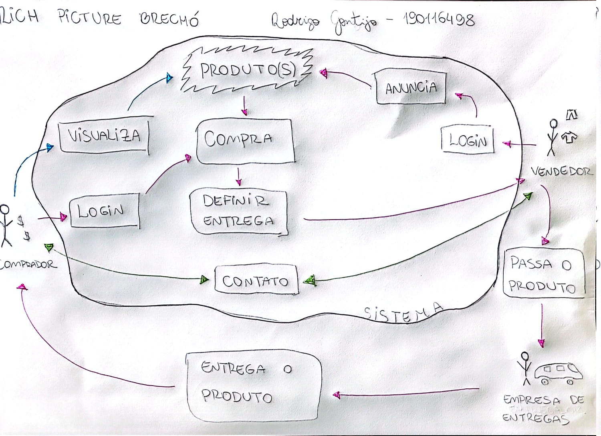
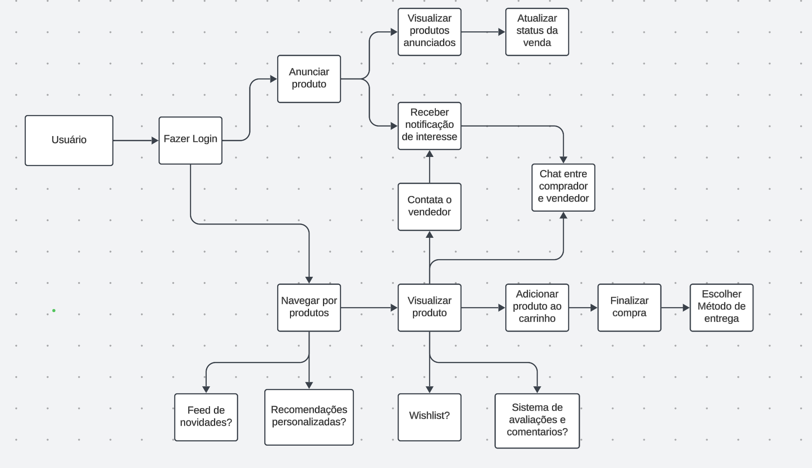

# 1.1. Módulo Design Sprint

## Unpack

Segundo Serrano (2024), na etapa Unpack objetivo é gerar vários insights, produzidos com a participação de todos. Devem ser debatidos vários aspectos da solução computacional, explorando o escopo e gerando compreensões sobre o problema a ser resolvido.

Para isso, foi escolhida a técnica elicitação de requisitos Análise de Concorrentes. Segundo Marsicano (2024), esse método permite extrair informações valiosas sobre as necessidades dos clientes ao examinar soluções existentes. Analisamos os sites **OLX**, **Enjoei**, **TROC**, **Baú da Bia**, **Repassa** e **Garimpário**, identificando tanto características comuns quanto exclusivas. As principais funcionalidades identificadas foram:

#### 1. Filtros de Busca e Organização
   - Todos os sites oferecem filtros como categoria, preço (do menor para o maior e vice-versa) e opções específicas (tamanho, condição e popularidade) para facilitar a busca e a navegação.

#### 2. Opções de Contato
   - Há a possibilidade de contato com o vendedor por meio de redes sociais, e-mail ou WhatsApp.

#### 3. Login Unificado
   - **OLX**, **Enjoei**, **TROC** e **Repassa** permitem que os usuários atuem tanto como compradores quanto como vendedores com uma única conta, evitando a necessidade de criar perfis distintos.

#### 4. Interação com Produtos
   - A maioria dos sites oferece meios de interação com os produtos, como comentários (**Enjoei**, **Baú da Bia**), chat para negociação (**OLX**) e listas de desejos (**Garimpário**).

#### 5. Promoções e Cupons de Desconto
   - Artigos em promoção recebem destaque na página inicial. Além disso, é possível usar cupons de desconto nas compras.

#### 6. Sistema de Reembolso ou Devolução
   - Alguns sites, como **Enjoei** e **Baú da Bia**, contam com políticas de reembolso e devolução aos consumidores.

#### 7. Entrega e Parcerias para Frete
   - Muitos dos sites contam com serviços de entrega ou parcerias para envio, como **Enjoei** (Correios) e os sistemas de entrega próprios da **OLX** e **Repassa**.

#### 8. Informações sobre o Vendedor e o Produto
   - Ao clicar em um produto, detalhes como descrição, medidas e peso são exibidos. No caso do **Enjoei**, é possível visualizar informações sobre o vendedor, como produtos à venda, vendidos, tempo de cadastro e avaliações.

#### 9. Formas de Pagamento e Cálculo de Frete
   - Os sites analisados oferecem múltiplas formas de pagamento (cartão de crédito/débito e PIX) e a possibilidade de cálculo do frete ao inserir o CEP.

Essa pesquisa permitiu consolidar um entendimento amplo das funcionalidades essenciais de um brechó. Com base nela, foi elaborado um [Mapa Mental](/docs/Base/1.2.ArtefatoGeneralista.md).

## Sketch

Ainda segundo Serrano (2024), na fase *sketch* o objetivo é gerar desenhos de várias ideias, usando como base o que foi acordado na fase anterior, sob a perspectiva de cada membro da equipe.

Pode-se dizer que aqui cada membro desenha como ele imagina que aquela ideia deva ocorrer, considerando o que foi debatido na fase *unpack*.

### Rich Picture

#### Introdução 

*Rich Picture* é uma representação visual de uma ideia, feito a mão livre ou com ferramentas, para representar atividades, ideias, entre outros. Nos *Rich Pictures* elaborados, os usuários incluem compradores em busca de produtos sustentáveis e vendedores que desejam desapegar de roupas. A plataforma deve ser intuitiva, facilitando o cadastro de produtos e a navegação. Os processos envolvem desde a listagem de itens até o sistema de pagamento. As interações entre compradores e vendedores, como perguntas e avaliações, são essenciais para criar confiança e engajamento.

Os *Rich Pictures* (RPs) para *Sketch* foram feitos para ilustrar processos do brechó sob a perspectiva de diferentes membros com base nos resultados da fase **Design Sprint - Unpack**.

#### RP1

Figura 1 - Rich Picture 1.

Fonte: Ana L. H. Ferreira

#### RP2

Figura 2 - Rich Picture 2.

Fonte: Rodrigo Gontijo

#### RP3

Figura 3 - Rich Picture 3.

Fonte: Luiz G. P. Pettengill

## Referência Bibliográfica

> SERRANO, Milene. Arquitetura e Desenho de Software: AULA - Projeto e desenho de software. Disponível em: <https://aprender3.unb.br/course/view.php?id=19535>. Acesso em: 31 out. de 2024.

> MARSICANO, George. Elicitação e Descoberta de Requisitos - Técnicas de Elicitação e Descoberta de Requisitos. 

## Histórico de Versões

| Versão |     Data    | Descrição   | Autor(es) | Revisor(es) |
| ------ | ----------- | ----------- | --------- | ----------- |
| `1.0`  | 31/10/2024  | Adição da etapa Unpack | [Lucas Spinosa](https://github.com/LucasSpinosa), [Marco Tulio](https://github.com/MarcoTulioSoares) e [Douglas Marinho](https://github.com/M4RINH0)  | [Luiz Pettengill](https://github.com/LuizPettengill) |
| `1.1`  | 01/11/2024  | Adição de link para Mapa Mental | [Lucas Spinosa](https://github.com/LucasSpinosa) | [Ana Hoffmann](https://github.com/AnHoff) |
| `1.2`  | 03/11/2024  | Adição da etapa Sketch + Rich Pictures | [Ana Hoffmann](https://github.com/AnHoff) e [Luiz Pettengill](https://github.com/LuizPettengill) | [Lucas Spinosa](https://github.com/LucasSpinosa) |