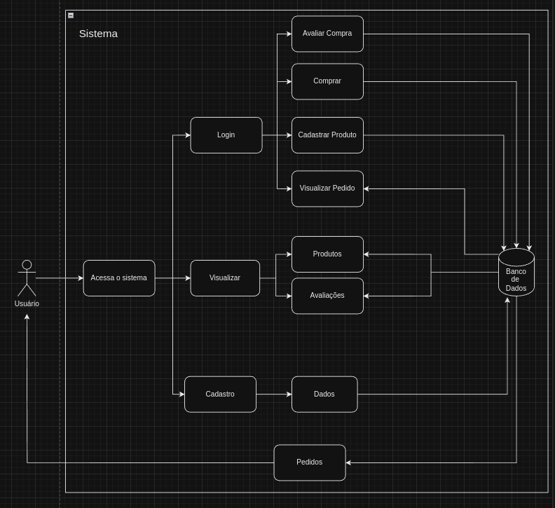

# 1.1. Módulo Design Sprint

O Design Sprint é uma metodologia criada pela Google Ventures com o objetivo de ajudar equipes a resolverem problemas em um curto período de tempo, geralmente em um espaço de apenas uma semana. Nesse período, a equipe se faz reuniões para entender o problema, discutir soluções e as prototipar. O objetivo é chegar rapidamente  em uma solução aceitável que atenda às necessidades dos usuários e gerando resultados positivos para o negócio.

## Unpack

Segundo Serrano (2024), na etapa Unpack objetivo é gerar vários insights, produzidos com a participação de todos. Devem ser debatidos vários aspectos da solução computacional, explorando o escopo e gerando compreensões sobre o problema a ser resolvido.

Para isso foi usada a técnica elicitação de requisitos Análise de Concorrentes. Segundo Marsicano (2024), esse método permite extrair informações valiosas sobre as necessidades dos clientes ao examinar soluções existentes. Analisamos os sites **OLX**, **Enjoei**, **TROC**, **Baú da Bia**, **Repassa** e **Garimpário**, identificando tanto características comuns quanto exclusivas. As principais funcionalidades identificadas foram:

#### 1. Filtros de Busca e Organização

- Todos os sites oferecem filtros como categoria, preço (do menor para o maior e vice-versa) e opções específicas (tamanho, condição e popularidade) para facilitar a busca e a navegação.

#### 2. Opções de Contato

- Há a possibilidade de contato com o vendedor por meio de redes sociais, e-mail ou WhatsApp.

#### 3. Login Unificado

- **OLX**, **Enjoei**, **TROC** e **Repassa** permitem que os usuários atuem tanto como compradores quanto como vendedores com uma única conta, evitando a necessidade de criar perfis distintos.

#### 4. Interação com Produtos

- A maioria dos sites oferece meios de interação com os produtos, como comentários (**Enjoei**, **Baú da Bia**), chat para negociação (**OLX**) e listas de desejos (**Garimpário**).

#### 5. Promoções e Cupons de Desconto

- Artigos em promoção recebem destaque na página inicial. Além disso, é possível usar cupons de desconto nas compras.

#### 6. Sistema de Reembolso ou Devolução

- Alguns sites, como **Enjoei** e **Baú da Bia**, contam com políticas de reembolso e devolução aos consumidores.

#### 7. Entrega e Parcerias para Frete

- Muitos dos sites contam com serviços de entrega ou parcerias para envio, como **Enjoei** (Correios) e os sistemas de entrega próprios da **OLX** e **Repassa**.

#### 8. Informações sobre o Vendedor e o Produto

- Ao clicar em um produto, detalhes como descrição, medidas e peso são exibidos. No caso do **Enjoei**, é possível visualizar informações sobre o vendedor, como produtos à venda, vendidos, tempo de cadastro e avaliações.

#### 9. Formas de Pagamento e Cálculo de Frete

- Os sites analisados oferecem múltiplas formas de pagamento (cartão de crédito/débito e PIX) e a possibilidade de cálculo do frete ao inserir o CEP.

Essa pesquisa permitiu consolidar um entendimento amplo das funcionalidades essenciais de um brechó. Com base nela, foi elaborado um [Mapa Mental](/Base/1.2.ArtefatoGeneralista.md).

## Sketch

Ainda segundo Serrano (2024), na fase _sketch_ o objetivo é gerar desenhos de várias ideias, usando como base o que foi acordado na fase anterior, sob a perspectiva de cada membro da equipe.

Pode-se dizer que aqui cada membro desenha como ele imagina que aquela ideia deva ocorrer, considerando o que foi debatido na fase _unpack_.

### Rich Picture

#### Introdução

_Rich Picture_ é uma representação visual de uma ideia, feito a mão livre ou com ferramentas, para representar atividades, ideias, entre outros. Nos _Rich Pictures_ elaborados, os usuários incluem compradores em busca de produtos sustentáveis e vendedores que desejam desapegar de roupas. A plataforma deve ser intuitiva, facilitando o cadastro de produtos e a navegação. Os processos envolvem desde a listagem de itens até o sistema de pagamento. As interações entre compradores e vendedores, como perguntas e avaliações, são essenciais para criar confiança e engajamento.

Os _Rich Pictures_ (RPs) para _Sketch_ foram feitos para ilustrar processos do brechó sob a perspectiva de diferentes membros com base nos resultados da fase **Design Sprint - Unpack**.

#### RP1

Figura 1 - Rich Picture 1.

Fonte: Ana L. H. Ferreira

#### RP2

Figura 2 - Rich Picture 2.

Fonte: Rodrigo Gontijo

#### RP3

Figura 3 - Rich Picture 3.

Fonte: Luiz G. P. Pettengill

#### RP4

Figura 4 - Rich Picture 4.

Fonte: Henrique Torres e Eric Camargo

## Decision

Nessa fase, a equipe se reuniu para juntar as ideias da etapa anterior (Sketch) e definir as principais funções e operações do sistema. Para isso, eles usaram os Rich Pictures criados na fase anterior por cada membro e combinaram todas as ideias em uma única imagem. O resultado foi um desenho simples e fácil de entender, que mostra os principais processos que o sistema deve ter.

Para o desenvolvimento das Rich Pictures, foi escolhido uma equipe de três participantes que se reuniu em chamada via Discord e conversou sobre os artefatos produzidos. Cada um dos três participantes produziu um Rich Picture assincronamente. Depois da discussão, foi escolhido o artefato da membro Ana L. H. Ferreira, porque apresenta um fluxo que se alinha melhor com o funcionamento esperado para uma loja virtual. Um dos pontos fortes dessa representação é que ela permite ao usuário visualizar produtos, avaliações, lojas e promoções sem precisar estar cadastrado, o que melhora a experiência de navegação e incentiva o uso do site de forma mais acessível e prática.

Além disso, a Rich Picture escolhida mostra claramente de onde os dados são obtidos e para onde vão, ilustrando o papel do banco de dados no armazenamento e recuperação de informações. O fluxo é bem estruturado, com um início, meio e fim bem definidos, o que facilita o entendimento dos processos e contribui para um sistema mais organizado e intuitivo para o usuário. Essa estrutura torna o sistema mais eficiente e fácil de ser implementado.

## Protótipo

Aqui foi feita algumas telas de protótipo para conseguirmos dimensionar como ficarão alguns requisitos e a estilização da aplicação.

### Tela de Login

### Tela de Cadastro

### Home da Aplicação

### Tela de Produto

## Referência Bibliográfica

> SERRANO, Milene. Arquitetura e Desenho de Software: AULA - Projeto e desenho de software. Disponível em: <https://aprender3.unb.br/course/view.php?id=19535>. Acesso em: 31 out. de 2024.

> MARSICANO, George. Elicitação e Descoberta de Requisitos - Técnicas de Elicitação e Descoberta
> de Requisitos.

## Histórico de Versões

| Versão | Data       | Descrição                              | Autor(es)                                                                                                                                          | Revisor(es)                                          |
| ------ | ---------- | -------------------------------------- | -------------------------------------------------------------------------------------------------------------------------------------------------- | ---------------------------------------------------- |
| `1.0`  | 31/10/2024 | Adição da etapa Unpack                 | [LucasSpinosa](https://github.com/LucasSpinosa), [Marco Tulio](https://github.com/MarcoTulioSoares), [Douglas Marinho](https://github.com/M4RINH0) | [Luiz Pettengill](https://github.com/LuizPettengill) |
| `1.1`  | 01/11/2024 | Adição de link para Mapa Mental        | [LucasSpinosa](https://github.com/LucasSpinosa)                                                                                                    |                                                      |
| `1.2`  | 03/11/2024 | Adição da etapa Sketch + Rich Pictures | [Ana Hoffmann](https://github.com/AnHoff) e [Luiz Pettengill](https://github.com/LuizPettengill)                                                   | [Lucas Spinosa](https://github.com/LucasSpinosa)     |
| `1.3`  | 03/11/2024 | Adição da etapa de Decision            | [Eric Camargo](https://github.com/ericcs10), [Henrique Torres](https://github.com/henriqtorresl)                                                   | [Lucas Spinosa](https://github.com/LucasSpinosa)     |
| `1.4`  | 03/11/2024 | Adição da etapa de Protótipo           | [Guilherme Evangelista](https://github.com/guinuto)                                                                                                | [Lucas Spinosa](https://github.com/LucasSpinosa)     |
| `1.5`  | 03/11/2024 | Adicionando o Rich Picture 4           | [Eric Camargo](https://github.com/ericcs10), [Henrique Torres](https://github.com/henriqtorresl)                                                   | [Lucas Spinosa](https://github.com/LucasSpinosa)     |
| `1.6`  | 04/11/2024 | Correção da exibição imagens do documento | [Marcelo Magalhães](https://github.com/marrcelo)                                                                                                | [Lucas Spinosa](https://github.com/LucasSpinosa)     |
| `1.7`  | 04/11/2024 | Introdução sobre Design Sprint  | [Marcelo Magalhães](https://github.com/marrcelo)                                                              | [Lucas Spinosa](https://github.com/LucasSpinosa)     |