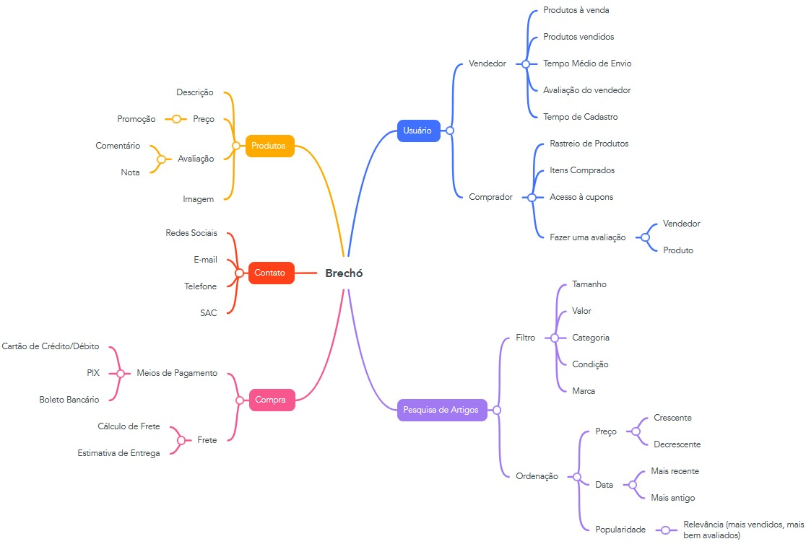

# 1.2. Módulo Artefato Generalista

## Mapa Mental

Mapa Mental é um artefato usado para se documentar diferentes aspectos, pontos de vista, entre outros, a cerca de um objeto de investigação. No centro do mapa coloca-se o objeto de investigação. A partir dele, cria-se ramificações, que seriam os diferentes aspectos sobre o objeto.

Com base no resultado da etapa [Unpack](/docs/Base/1.1.DesignSprint.md), foi elaborado o seguinte mapa mental, que ilustra visualmente aspectos pertinentes do brechó.

## Histórico de Versões

| Versão | Data       | Descrição             | Autor(es)                                                                                                                                            | Revisor(es)                               |
| ------ | ---------- | --------------------- | ---------------------------------------------------------------------------------------------------------------------------------------------------- | ----------------------------------------- |
| `1.0`  | 01/10/2024 | Adição do Mapa Mental | [Lucas Spinosa](https://github.com/LucasSpinosa), [Marco Tulio](https://github.com/MarcoTulioSoares) e [Douglas Marinho](https://github.com/M4RINH0) | [Ana Hoffmann](https://github.com/AnHoff) |