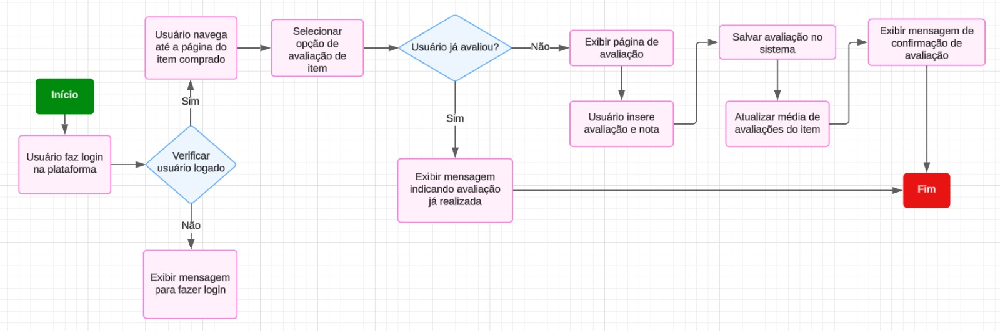

# 1.3. Módulo Modelagem BPMN

## BPMN 1 - Compra de um Item

Figura 2 - Rich Picture 2.

Fonte: [Ana Hoffmann](https://github.com/AnHoff), [LucasSpinosa](https://github.com/LucasSpinosa) e [Luiz Pettengill](https://github.com/LuizPettengill)

O diagrama BPMN apresentado descreve o fluxo de compra de um item no brechó. O fluxo começa com o usuário acessando o site e explorando o catálogo em busca de um artigo. Ao achar algo de interesse, deve então realizar o login ou se cadastrar para poder utilizar o carrinho de compras e adicionar o produto a ele.

Feito isso, avança para a página de pagamento, confirma se os dados do pedido estão corretos (como o endereço da entrega, por exemplo), seleciona o frete desejado para a entrega e realiza o pagamento. Nesse momento, o sistema emite a nota fiscal. Ao usuário receber a nota fiscal, o processo de compra é encerrado.

## BPNM 2 - Deixar Avaliação de Item

    

Fonte:<a href="https://github.com/henriqtorresl" style="margin-left: 2px; margin-right: 2px" target="_blank">Henrique Torres</a> e <a href="https://github.com/Ericcs10" style="margin-left: 2px;" target="_blank">Eric Camargo</a> 

O diagrama BPMN apresentado descreve o fluxo para a atividade de deixar uma avaliação de item em um site de brechó online, semelhante ao estilo de marketplace. O processo começa com o usuário fazendo login na plataforma e navegando até a página do item que ele adquiriu. Em seguida, o sistema verifica se o usuário já está logado e, caso contrário, exibe uma mensagem solicitando o login.

Uma vez logado, o usuário pode selecionar a opção de avaliação do item. O sistema então verifica se ele já deixou uma avaliação para o item. Se o usuário já avaliou, uma mensagem informando que a avaliação já foi realizada é exibida. Caso contrário, é apresentada a página de avaliação, onde o usuário insere sua nota e comentários.

Ao confirmar a avaliação, o sistema salva os dados e atualiza a média de avaliações do item. Uma mensagem de confirmação é exibida ao usuário, indicando que a avaliação foi registrada com sucesso, finalizando o processo.

Este diagrama foi projetado para manter uma estrutura compacta, evitando uma expansão exagerada tanto na horizontal quanto na vertical, proporcionando uma visualização clara e objetiva do fluxo de avaliação de itens.

## BPNM 3 - Colocar Item à Venda

Figura 3 - BPNM 3.

Fonte: [Marcelo Ferreira](https://github.com/marrcelo), [Marco Tulio](https://github.com/MarcoTulioSoares) e [Rodrigo Gontijo](https://github.com/rodrigogontijoo)

O diagrama BPMN apresentado descreve o fluxo de colocar um item à venda no brechó. O fluxo começa verificando se o vendedor possui cadastro ou não, pois para anunciar um item, é preciso estar cadastrado. Em seguida, o vendedor fornece todos os dados necessários para vender um produto. No fim, se o vendedor deseja revisar os dados que ele inseriu, ele volta novamente para a parte de fornecer os dados. Se isso não é do interesse do vendedor, o anúncio é criado e o fluxo é finalizado.

## BPNM 4 - Rastrear Pedido

    

Fonte:<a href="https://github.com/henriqtorresl" style="margin-left: 2px; margin-right: 2px" target="_blank">Henrique Torres</a> e <a href="https://github.com/Ericcs10" style="margin-left: 2px;" target="_blank">Eric Camargo</a> 

O diagrama BPMN apresentado descreve o fluxo de rastreamento de pedidos em um site de brechó online. O processo inicia quando o usuário acessa o site e faz login em sua conta. Após o login, o sistema verifica se o usuário possui pedidos disponíveis.

Caso o usuário não tenha pedidos, uma mensagem é exibida informando que não há pedidos disponíveis para rastreamento. Se houver pedidos, o sistema exibe uma lista de pedidos para o usuário escolher qual deseja rastrear. Após a seleção, o status atual do pedido é exibido.

O sistema então verifica se o pedido já foi entregue. Se o pedido foi entregue, o usuário é informado que o pedido já foi entregue, e o fluxo é encerrado. Se o pedido ainda não foi entregue, o sistema apresenta o status atual e uma estimativa da data de entrega.

O usuário pode optar por continuar monitorando o pedido, mantendo o acompanhamento até que o pedido seja entregue, ou finalizar o rastreamento, agradecendo e encerrando o processo. Este diagrama foi desenhado de forma a manter uma estrutura clara e concisa, facilitando o entendimento das etapas envolvidas no rastreamento de pedidos.

## Histórico de Versões

| Versão | Data       | Descrição             | Autor(es)                                                                                         | Revisor(es)                               |
| ------ | ---------- | --------------------- | ------------------------------------------------------------------------------------------------- | ----------------------------------------- |
| `1.0`  | 01/10/2024 | Adição dos BPNM 2 e 4 | [Henrique Torres](https://github.com/henriqtorresl) e [Eric Camargo](https://github.com/Ericcs10) | [Ana Hoffmann](https://github.com/AnHoff) |
| `1.1`  | 03/10/2024 | Adição do BPNM 1 | [Lucas Spinosa](https://github.com/LucasSpinosa), [Ana Hoffmann](https://github.com/AnHoff) e [Luiz Pettengill](https://github.com/LuizPettengill) | [Ana Hoffmann](https://github.com/AnHoff) |
| `1.2`  | 03/10/2024 | Adição do BPNM 3 |[Marcelo Ferreira](https://github.com/marrcelo), [Marco Tulio](https://github.com/MarcoTulioSoares) e [Rodrigo Gontijo](https://github.com/rodrigogontijoo) | [Lucas Spinosa](https://github.com/LucasSpinosa) |

