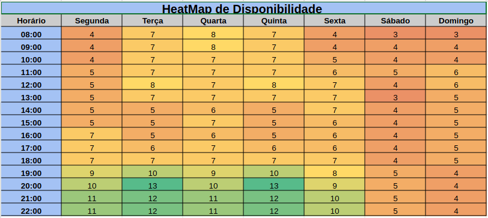
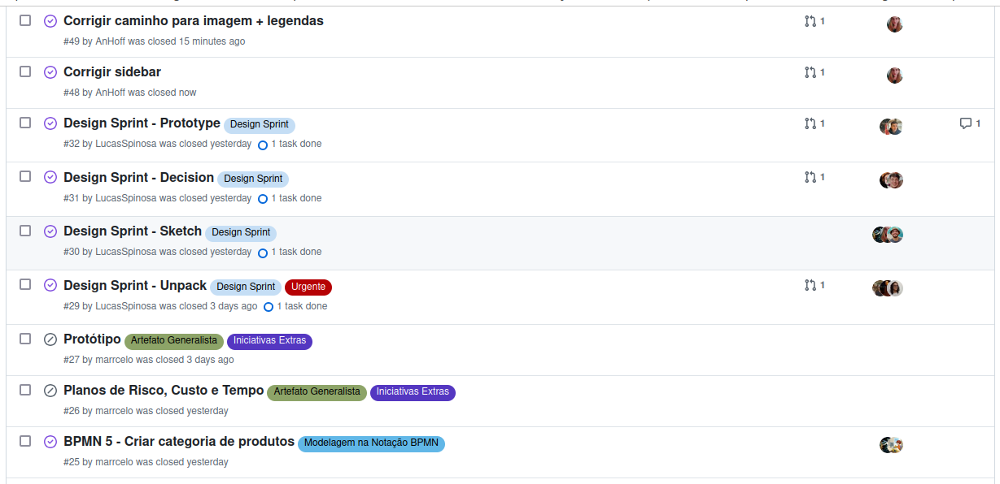
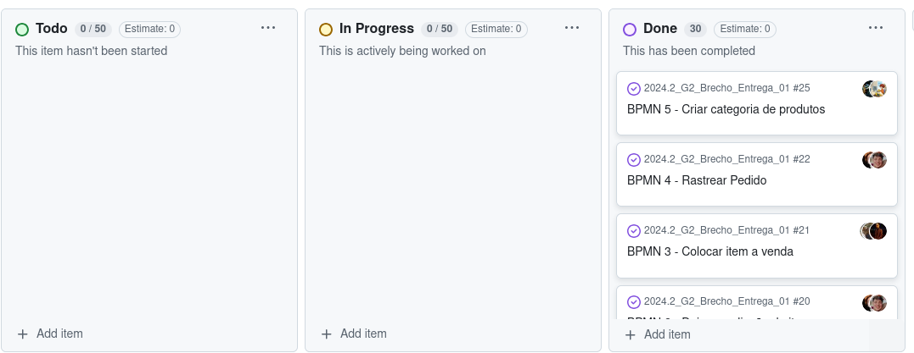

# 1.5. Iniciativas Extras (Base)

## Heatmap de Disponibilidade

A equipe realizou um heatmap de disbonibilidade de horários, onde uma tabela foi criada com todos os dias da semana e horários de 08h até 22h.

Cada membro tem uma aba com seu nome, onde deveria colocar o valor 0 se não estivesse disponível para reunião naquele horário e 1 caso estivesse disponível.

Na aba 'Resumo', é mostrado o quantitativo de valores 1 para aquele horário, de forma que os horários com maior valor são os mais propícios para uma reunião. O heatmap pode ser visualizado nesse [link](https://docs.google.com/spreadsheets/d/1fqkuAnjbb6iXAewmmT09v_5l_ieYu68Zpluc57u30L0/edit?gid=167832767#gid=167832767).

## Issues de Atividades

Para ajudar a rastrear as atividades (quais estão completas e quais estão pendentes) e também rastrear quem ficou responsável de realizá-las, foram criadas issues de cada atividade da entrega 1 no GitHub, que podem ser visualizadas nesse [link](https://github.com/UnBArqDsw2024-2/2024.2_G2_Brecho_Entrega_01/issues).

## Kanban

Além das issues de atividades mencionadas acima, também foi feito um Kanban para acompanhar o estado de cada atividade (Para Fazer, Em Progresos e Feito).

O Kanban pode ser acessado nesse [link](https://github.com/orgs/UnBArqDsw2024-2/projects/3).

## Heatmap

## Histórico de Versões

| Versão | Data       | Descrição                              | Autor(es)                                                                                                                                          | Revisor(es)                                          |
| ------ | ---------- | -------------------------------------- | -------------------------------------------------------------------------------------------------------------------------------------------------- | ---------------------------------------------------- |
| `1.0`  | 04/11/2024 | Adição de Heatmap, Issues e Kanban | [LucasSpinosa](https://github.com/LucasSpinosa) | [Eduardo Belarmino Silva](https://github.com/eduard0803)| 