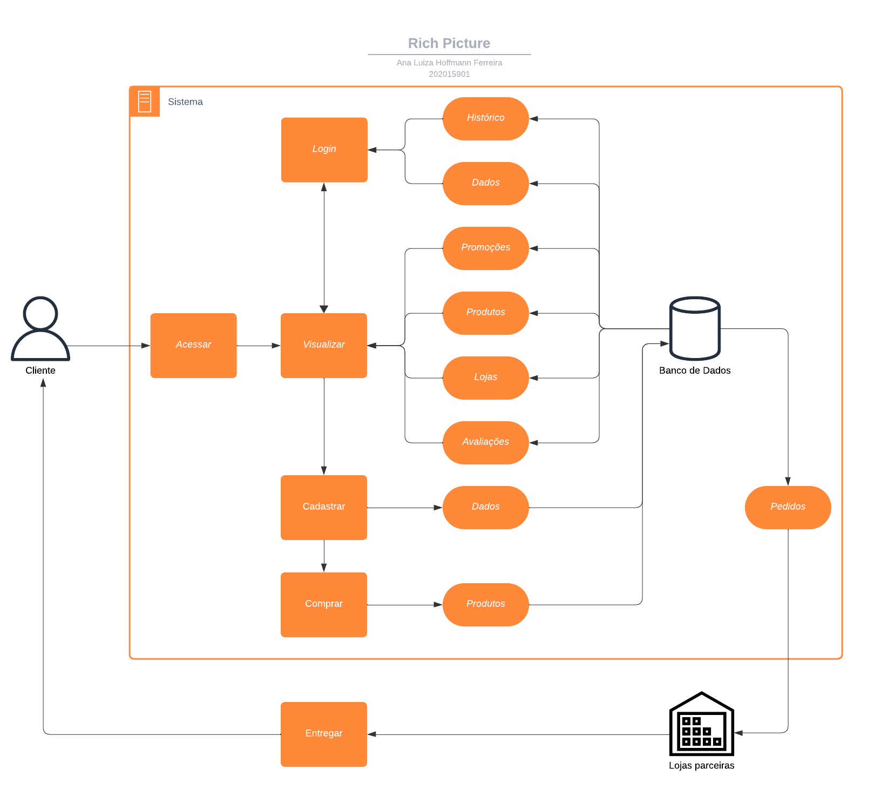
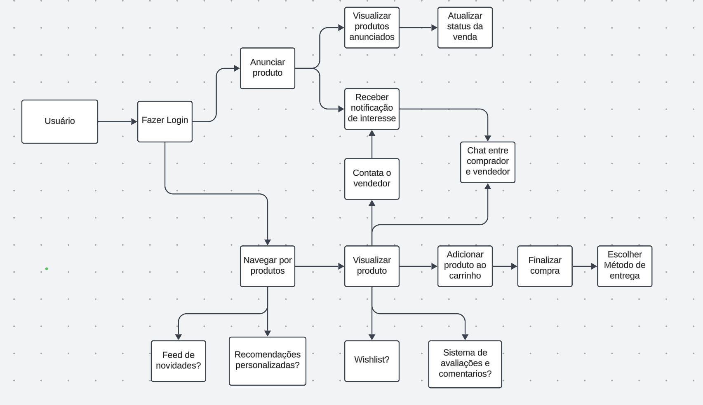

# Rich Picture

## Introdução 

Rich Picture é uma representação visual de uma ideia, feito a mão livre ou com ferramentas, para representar atividades, ideias, entre outros. Nos Rich Pictures elaborados, os usuários incluem compradores em busca de produtos sustentáveis e vendedores que desejam desapegar de roupas. A plataforma deve ser intuitiva, facilitando o cadastro de produtos e a navegação. Os processos envolvem desde a listagem de itens até o sistema de pagamento. As interações entre compradores e vendedores, como perguntas e avaliações, são essenciais para criar confiança e engajamento.

## Rich Picture
Foram elaboradas *Rich Pictures* (RPs) com base nos resultados da fase **Design Sprint - Unpack**.

## RP1

## RP2

## RP3

