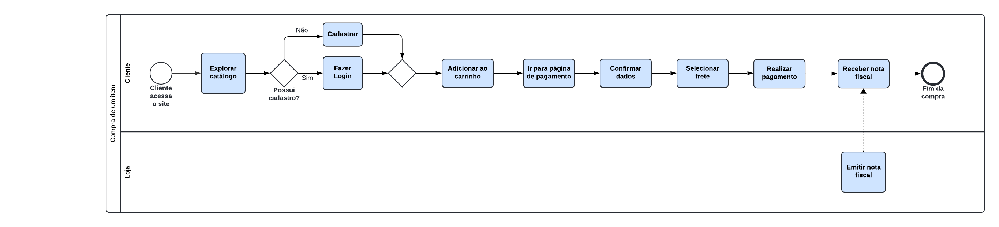

# UnBrechó

**Código da Disciplina**: FGA0208 
**Número do Grupo**: 02 
**Entrega**: 01 

## Alunos

| Matrícula | Aluno                                     | Github           |
| --------- | ----------------------------------------- | ---------------- |
| 202015901 | Ana Luiza Hoffmann Ferreira               | [AnHoff](https://github.com/AnHoff)          |
| 221037465 | Douglas Marinho Martins                   | [M4RINH0](https://github.com/M4RINH0)        |
| 221008580 | Eduardo Belarmino Silva                   | [eduard0803](https://github.com/eduard0803)  |
| 202016168 | Eric Camargo da Silva                     | [Ericcs10](https://github.com/Ericcs10)      |
| 200038028 | Guilherme Evangelista Ferreira dos Santos | [guinuto](https://github.com/guinuto)        |
| 202016524 | Henrique Torres Landin                    | [henriqtorresl](https://github.com/henriqtorresl) |
| 180022512 | Lucas de Lima Spinosa dos Santos          | [LucasSpinosa](https://github.com/LucasSpinosa) |
| 150138202 | Luiz Guilherme Palhares Pettengill        | [luizpettengill](https://github.com/LuizPettengill)|
| 190047348 | Marcelo Ferreira Magalhães Júnior         | [marrcelo](https://github.com/marrcelo)      |
| 221008310 | Marco Tulio                               | [MarcoTulioSoares](https://github.com/MarcoTulioSoares) |
| 190116498 | Rodrigo Braz Ferreira Gontijo             | [rodrigogontijoo](https://github.com/rodrigogontijoo)  |
| 190020521 | Valderson Pontes da Silva Junior          | [valdersonjr](https://github.com/valdersonjr)      |

## Sobre

O UnBrechó é uma aplicação web que visa ser um brechó online, permitindo que pessoas explorem um catálogo de produtos novos e usados, anunciem artigos, deixem avaliações sobre produtos e vendedores e realizem suas compras.

Essa documentação visa documentar todos os artefatos exigidos pela docente na primeira entrega da disciplina, sendo eles: **Design Sprint**, **Artefatos Generalistas**, **BPMN**.

## Screenshots da Primeira Entrega

## Há algo a ser executado?

( ) SIM

( X ) NÃO